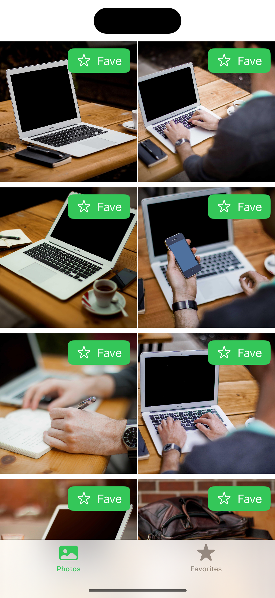

# Picsum Photos — Sample App

- Creates an iOS app that loads a set of images from Lorem Picsum (https://picsum.photos) and displays them in a SwiftUI Grid (2 images per line). When the orientation of the device is changed, the grid adapts (4 images per line). 

- When an image is selected, a detailed view opens in which the image is displayed in high resolution with the corresponding Author. The images in the preview should be loaded as efficiently as possible.

- The app loads more images into the Grid as soon as the user scrolls down far enough.

- The user can favorie an image. It is also possible to remove images from this list.

